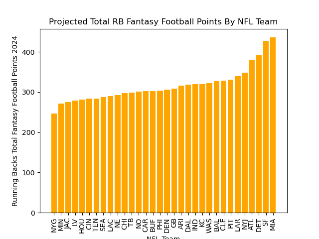
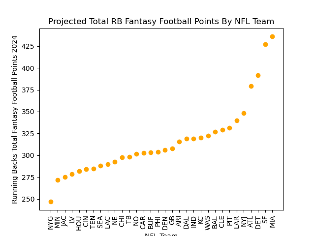

# Danish_Maknojia_MP9

# Setting Up a Google Colab Notebook

## Introduction

Google Colab is a powerful cloud-based platform that allows you to write and execute Python code in your browser. It’s especially useful for data science, machine learning, and deep learning projects, as it provides free access to GPUs and TPUs, enabling you to run resource-intensive computations without needing local hardware.

## Benefits of Using Google Colab

- **No Installation Required**: You can run your notebooks directly in your web browser without any setup.
- **Free Access to GPUs**: Easily access powerful hardware for faster computation.
- **Collaboration**: Share your notebooks with others, allowing multiple users to work simultaneously.
- **Integration with Google Drive**: Save and manage your notebooks in Google Drive for easy access from anywhere.
- **Rich Libraries and Tools**: Pre-installed libraries like TensorFlow, PyTorch, and Pandas make it easy to start coding right away.

## Setting Up Your Google Colab Notebook

1. **Sign in to Google Account**: Ensure you have a Google account. If you don’t, create one [here](https://accounts.google.com/signup).

2. **Access Google Colab**: Go to [Google Colab](https://colab.research.google.com/).

3. **Create a New Notebook**: 
   - Click on "File" in the top-left corner.
   - Select "New Notebook."

4. **Rename Your Notebook**: Click on the title (e.g., "Untitled0") at the top to give your notebook a meaningful name.

5. **Run Your Code**: Write your Python code in a cell and press `Shift + Enter` to execute it.

## Objectives
My project accomplishes the following tasks:
- Google Colab notebook using Pandas for descriptive statistics
- Read a dataset (CSV or Excel)
- Generate summary statistics (mean, median, standard deviation)
- Create at least one data visualization

## Data Set

- Fantasy_Football_Projections_RB.csv is a dataset with the average standard fantasy scoring projections from the top 4 fantasy football websites

## Project Content

- The project contains the Google Colab Notebook, which opens the Fantasy_Football_Projections_RB.csv, groups the data by team, and sorts in ascending order next a summary of statistics containing the mean, median (50%) & standard deviation, and two graphs are generated: one bar chart and the second a scatter graph.

## Summary Statistics

## Bar Chart

## Scatter Plot

