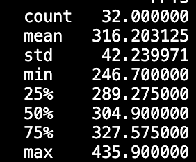

# Danish_Maknojia_MiniProject2

## Objectives
My project accomplishes the following tasks:
- Python script using Pandas for descriptive statistics
- Read a dataset (CSV or Excel)
- Generate summary statistics (mean, median, standard deviation)
- Create at least one data visualization

## Data Set

